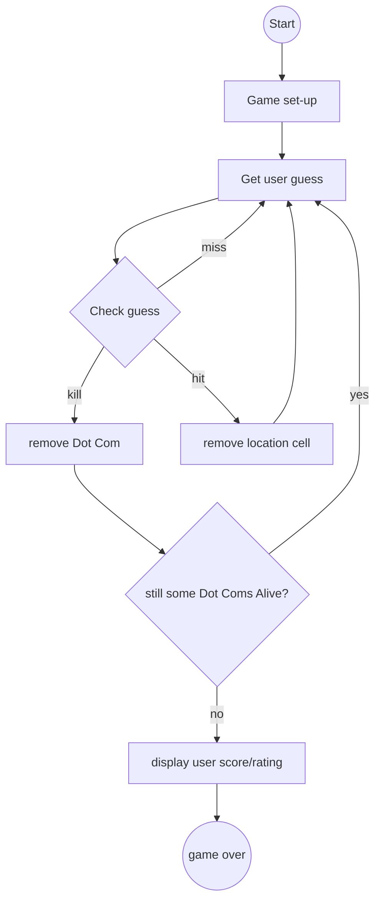
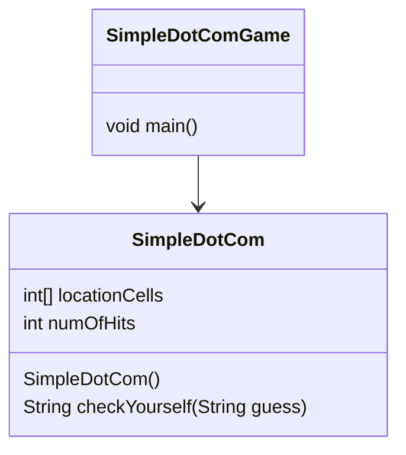

## Flow Chart

## ADT

   

### SimpleDotComGame  
> main function

   

### SimpleDotCom  
> 
  
> 
Member Variable
  
>
> - **Declare** an `int` array to keep the location. Call it *locationCells*   
> - **Declare** an `int` to count the number of hits. Call it *numOfHits*. **Set** it to 0 
> 

>
> 
  
> 
Member Function

>
> - **Declare** a *Constructer* that takes an `int` array (which has three cell locations as `int`)  
> - **Declare** a *checkYourself* method that take a `String` for the user's guess \(\"1\", \"4\", etc\), checks it, and returns a result representing a \"hit\", \"miss\", or \"kill\"  

   
   

## Prep Code  
### SimpleDotComGame  

   

### SimpleDotCom  

  

   
